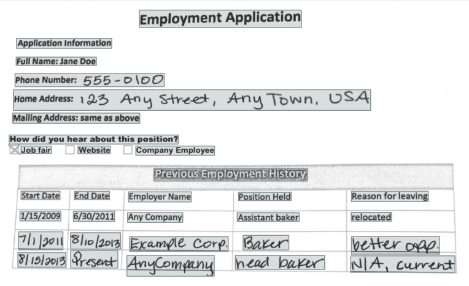

# AWS Textract

Amazon Textract is a deep learning service that automatically extracts text, handwriting and data from scanned documents that goes beyond simple optical character recognition (OCR) to identify, understand, and extract data from forms and tables.</br>
Today, many companies manually extract data from scanned documents like PDFs, images, tables and forms, or through simple OCR software that requires manual configuration which often times requires reconfiguration when the form changes.</br>
To overcome these manual and expensive processes, Textract uses deep learning to read and process any type of document, accurately extracting text, handwriting, tables and other data without any manual effort.</br>
This solution was proposed to Citi and its management during my internship. Although elementary at this stage, it can be extended and automated to cover variety of statutory forms for all use cases from employee onboarding to compliance and can also be integrated within Citi's in-house services.</br>




## Setup

```bash
npm install
```

## Deploy

In order to deploy the endpoint simply run

```bash
serverless deploy
```

The expected result should be similar to(given you have AWS set up on your local machine):

```bash
Serverless: Packaging service…
Serverless: Uploading CloudFormation file to S3…
Serverless: Uploading service .zip file to S3…
Serverless: Updating Stack…
Serverless: Checking Stack update progress…
Serverless: Stack update finished…

Service Information
service: serverless-rest-api-with-dynamodb
stage: dev
region: us-east-1
api keys:
  None
endpoints:
  POST - https://45wf34z5yf.execute-api.us-east-1.amazonaws.com/dev/todos
  GET - https://45wf34z5yf.execute-api.us-east-1.amazonaws.com/dev/todos
  GET - https://45wf34z5yf.execute-api.us-east-1.amazonaws.com/dev/todos/{id}
  PUT - https://45wf34z5yf.execute-api.us-east-1.amazonaws.com/dev/todos/{id}
  DELETE - https://45wf34z5yf.execute-api.us-east-1.amazonaws.com/dev/todos/{id}
functions:
  serverless-rest-api-with-dynamodb-dev-update: arn:aws:lambda:us-east-1:488110005556:function:serverless-rest-api-with-dynamodb-dev-update
  serverless-rest-api-with-dynamodb-dev-get: arn:aws:lambda:us-east-1:488110005556:function:serverless-rest-api-with-dynamodb-dev-get
  serverless-rest-api-with-dynamodb-dev-list: arn:aws:lambda:us-east-1:488110005556:function:serverless-rest-api-with-dynamodb-dev-list
  serverless-rest-api-with-dynamodb-dev-create: arn:aws:lambda:us-east-1:488110005556:function:serverless-rest-api-with-dynamodb-dev-create
  serverless-rest-api-with-dynamodb-dev-delete: arn:aws:lambda:us-east-1:488110005556:function:serverless-rest-api-with-dynamodb-dev-delete
```

## Usage

You can create, retrieve, update, or delete form fields with the following commands:

### Create a Form Entry
```bash
curl -X POST {post_endpoint} --data '{ "img_path": "img.png" }'
```

### List all Form Entries
```bash
curl {get_list_endpoint}
```

### Get one Form Entry
```bash
# Replace the {id} part with a real id from the table
curl {get_list_endpoint}/{id}
```

### Update a Todo
```bash
# Replace the {id} part with a real id from your the table
curl -X PUT {post_endpoint}/{id} --data '{ "img_path": "img.png" }'
```

### Delete a Todo
```bash
# Replace the {id} part with a real id from your the table
curl -X DELETE {delete_endpoint}/{id}
```
**All endpoints are provided in the project above.<br>
**Can also use localhost:3000 to make a POST request

